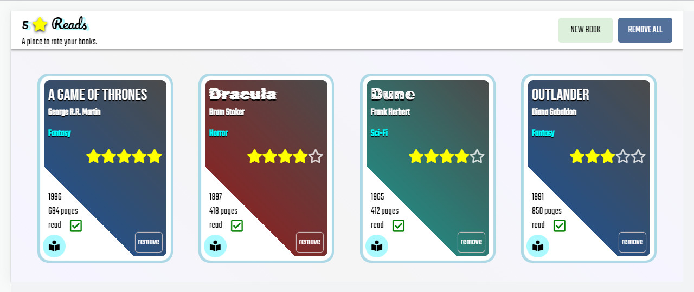

#  5 Star Reads | <a href="https://mattxmade.github.io/odin-library/" target="_blank"> <strong>Live</strong></a>

> ### A reading list and book rating web application

 

  
  
  ##
  
  
  
  

   

<strong>Application to create, view, update and delete book titles</strong>

This project is built using HTML CSS/Sass and JavaScript.

The aim for this project is to improve my skills using JavaScript Objects, Prototypes and better understand their concepts.

 

<strong>Features implemented:</strong>

<ul>
  <li>Form feature to add custom books</li>
  <li>Form validation to prevent duplicate titles</li>
  <li>Interactivity: Add/Remove books from library</li>
  <li>Interactivity: 5 star rating system</li>
  <li>Interactivity: Ability to change read status</li>
  <li>Interactivity: Cards can be flipped over to show book description</li>
  <li>Persistence: localStorage used to store user books</li>
</ul>
